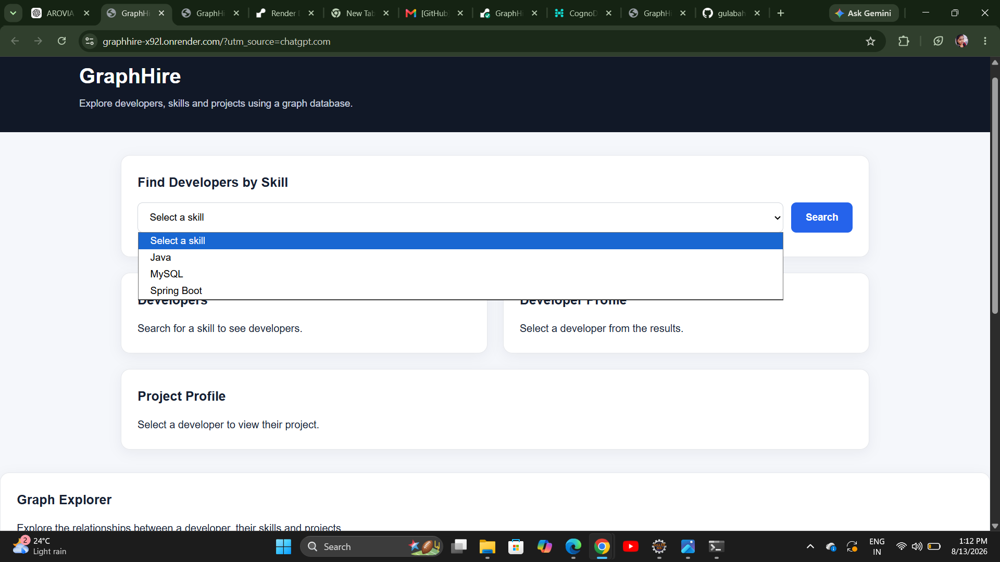
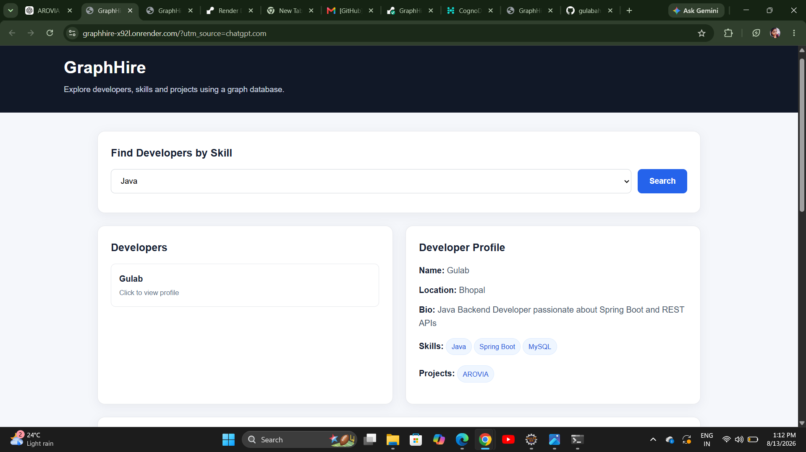
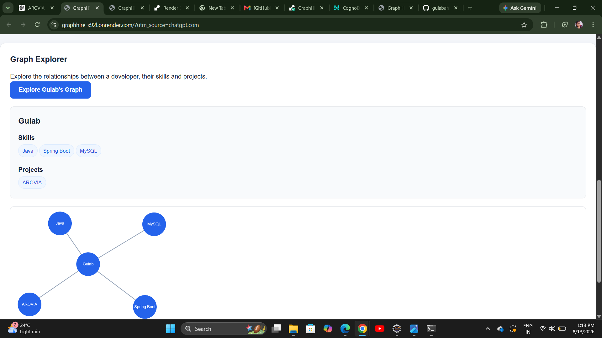

# GraphHire

GraphHire is a graph-based developer discovery application built with Spring Boot and CognoDB.

The application allows users to discover developers based on their skills and explore relationships between developers, skills, and projects.

---

## Features

- Search developers by skill
- View developer profiles
- View project profiles
- Explore developer-to-skill relationships
- Explore developer-to-project relationships
- Multi-hop graph traversal
- REST APIs
- Web-based user interface

---

## Technology Stack

- Java 21
- Spring Boot
- CognoDB
- Neo4j Java Driver
- Maven
- HTML
- CSS
- JavaScript

---

## Graph Model

The application uses a graph-based data model.

### Nodes

- Developer
- Skill
- Project

### Relationships

```text
Developer ──HAS_SKILL──> Skill
Developer ──WORKED_ON──> Project
Project ──USES──> Skill
```

---

## Why a Graph Database?

GraphHire focuses on relationships between developers, skills, and projects.

A relational database could store this information using multiple tables and join operations. However, a graph database is more suitable for exploring connected data and multi-hop relationships.

For example, GraphHire can easily answer questions such as:

- Which developers have a particular skill?
- Which projects are connected to a developer?
- Which skills are used by projects?
- Which developers are connected through shared skills?

CognoDB represents these connections directly as nodes and relationships, making graph traversal and relationship-based queries easier to express using Cypher.

---

## Setup and Run

### 1. Create a CognoDB Instance

1. Create an account at https://console.cognodb.com/signup
2. Create a free CognoDB instance.
3. Copy the Bolt connection URI and generated password.
4. Keep the credentials secure and do not commit them to GitHub.

### 2. Configure Environment Variables

Set the following environment variables:

```text
COGNODB_URI=bolt+s://your-instance.databases.cognodb.com:7687
COGNODB_USERNAME=cognodb
COGNODB_PASSWORD=your-password
```

The application reads these values from environment variables.

### 3. Run the Application

Clone the repository and run:

```bash
./mvnw spring-boot:run
```

The application will be available at:

```text
http://localhost:8080
```

---

## Hosted Demo

The deployed application is available at:

https://graphhire-x92l.onrender.com

---

## Cypher Queries

GraphHire uses Cypher queries through the official Neo4j Java Driver.

### Developer Graph Query

The Graph Explorer uses the following parameterized Cypher query:

```cypher
MATCH (d:Developer {name: $name})
OPTIONAL MATCH (d)-[:HAS_SKILL]->(s:Skill)
OPTIONAL MATCH (d)-[:WORKED_ON]->(p:Project)
RETURN d.name AS developer,
       collect(DISTINCT s.name) AS skills,
       collect(DISTINCT p.name) AS projects
```

The `$name` value is passed as a parameter through the Neo4j driver rather than being concatenated into the query.

The query explores the relationships:

```text
Developer → Skill
Developer → Project
```

It allows GraphHire to retrieve a developer's skills and projects in a single graph query.

### Multi-Hop Graph Traversal

GraphHire supports multi-hop traversal across connected nodes.

For example:

```text
Developer → Skill ← Project
```

The application uses the following parameterized Cypher query:

```cypher
MATCH (d:Developer {name: $name})
      -[:HAS_SKILL]->(s:Skill)
      <-[:USES]-(p:Project)
RETURN d.name AS developer,
       s.name AS skill,
       p.name AS project
ORDER BY p.name
```

This query traverses multiple relationships to find projects connected to a developer through their skills.

The `$name` value is supplied separately through the Neo4j Java Driver.

### Seed Data

The application uses Cypher `MERGE` statements in the seed service to create developers, skills, projects, and their relationships without creating duplicate graph nodes.

The seed data includes:

- Developer: Gulab
- Skills: Java, Spring Boot, MySQL
- Project: AROVIA

---

## Screenshots

### Developer Search



### Developer and Project Profile



### Graph Explorer



---

## API Endpoints

### Get All Skills

```http
GET /api/skills
```

Returns all available skills.

### Search Developers by Skill

```http
GET /api/developers?skill=Java
```

Returns developers who have the selected skill.

### Get Developer Profile

```http
GET /api/developers/{name}
```

Returns developer information including skills and projects.

### Get Developer Projects

```http
GET /api/developers/{name}/projects
```

Returns projects connected to a developer through shared skills.

### Get Project Profile

```http
GET /api/projects/{name}
```

Returns project information including skills and developers.

### Explore Developer Graph

```http
GET /api/graph/{name}
```

Returns the developer's connected skills and projects.

---

## Project Structure

```text
GraphHire
├── src
│   ├── main
│   │   ├── java
│   │   │   └── com.graphhire
│   │   │       ├── config
│   │   │       ├── controller
│   │   │       └── service
│   │   └── resources
│   │       ├── application.properties
│   │       └── static
│   │           ├── index.html
│   │           └── images
│   └── test
├── pom.xml
├── README.md
└── Dockerfile
```

---

## Security

Database credentials are not committed to the repository.

The CognoDB URI, username, and password are provided through environment variables.